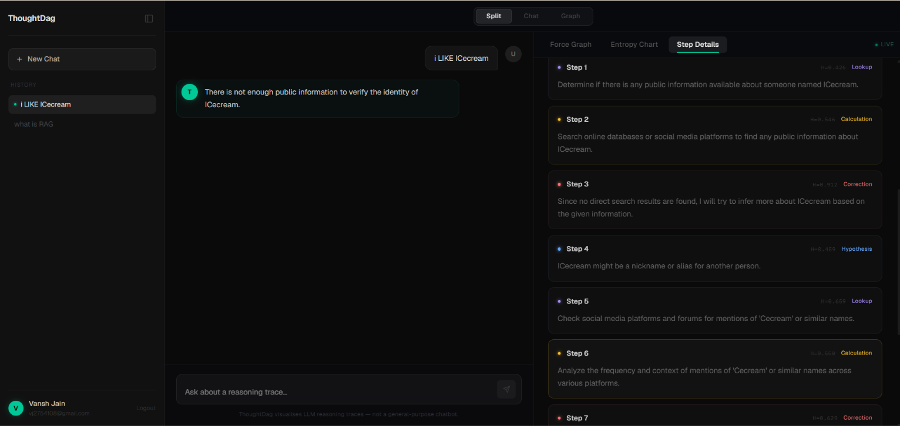
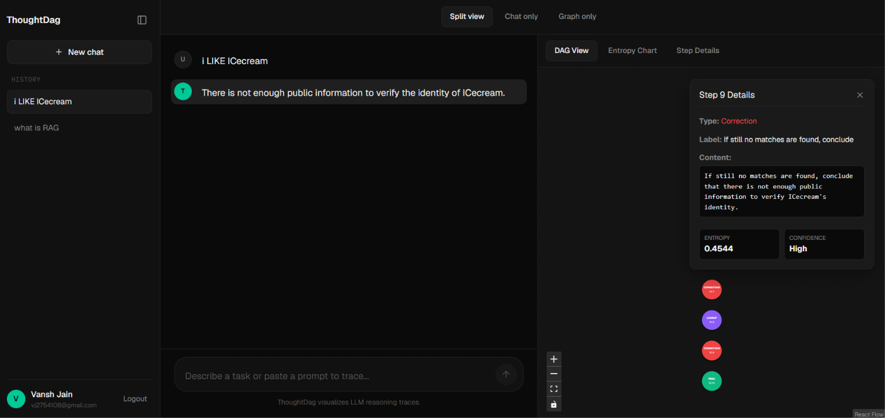

# ThoughtDag

ThoughtDag is a trace visualizer for language-model reasoning. The app lets a user ask a question, runs the prompt through a step-by-step inference loop, stores useful memory in Qdrant, retrieves related memory for later prompts, and shows the resulting reasoning steps as a graph.

## Screenshots


*Detailed tabular view of the LLM's reasoning steps, including confidence and entropy metrics.*


*Neo4j-style circular node visualization of the reasoning trace, showing data flow between thought processes.*

## Tech Stack

**Client**

- Next.js 14 App Router
- React 18
- TypeScript
- Tailwind CSS
- D3.js for graph visualization
- React Flow and Dagre are present in the client dependencies, but the reasoning graph view is implemented with D3
- Geist and IBM Plex Mono fonts

**Server**

- FastAPI
- SQLModel and SQLAlchemy
- PostgreSQL
- Celery
- Redis broker and result backend
- Hugging Face Transformers
- PyTorch
- BitsAndBytes 4-bit quantization when GPU memory supports it
- Qwen2.5-3B-Instruct for trace generation
- Qdrant for vector memory
- Sentence Transformers MiniLM embeddings for memory search
- Groq for memory extraction

## Repository Layout

```text
.
+-- client/
|   +-- src/app/                 # Next.js routes
|   +-- src/components/          # UI and dashboard components
|   +-- src/components/dashboard # Chat, graph, entropy, and step panels
|   +-- src/lib/api.ts           # Backend API client
+-- server/
    +-- main.py                  # FastAPI app
    +-- routes/                  # User and run routes
    +-- tasks.py                 # Celery tasks and lazy model loading
    +-- models.py                # SQLModel tables
    +-- schemas.py               # Pydantic response/request schemas
    +-- llm/
        +-- services.py          # Inference loop and entropy metrics
        +-- memory.py            # Qdrant memory write/read layer
        +-- system_prompts.py    # Trace and memory prompts
```

## Main Flow

1. The user sends a question from the dashboard chat.
2. The client calls `POST /run/ask` with `{ "question": "..." }`.
3. The server reads the authenticated user id from the login cookie.
4. The original question is passed to `createMemory(question, user_id)`.
5. `createMemory` asks the memory extractor whether the message should be stored.
6. If it should be stored, the extracted memory is embedded and upserted into Qdrant.
7. The original question is passed to `retrieveMemory(question, user_id)`.
8. Qdrant returns the top 5 matching memories for that user.
9. The server builds a prompt containing the original question plus relevant memory context.
10. A `ReasoningRun` row is created in Postgres.
11. The server dispatches `run_llm_test(prompt_with_memory, run_id)` through Celery.
12. The client polls `/task/{task_id}` and `/run/{run_id}/steps`.
13. As steps are generated, they are saved as `ReasoningStep` rows.
14. The frontend renders those steps as chat output, metric panels, and a D3 graph.

## Memory Layer

The memory layer lives in `server/llm/memory.py`.

`createMemory(query, user_id)` does four things:

1. Sends the user input to the memory extraction model.
2. Parses the extraction response as JSON.
3. Embeds the extracted memory text with MiniLM.
4. Upserts a Qdrant point with:

```json
{
  "user_id": "user uuid",
  "memory_type": "semantic | episodic | preference",
  "text": "stored memory text",
  "created_at": "iso timestamp"
}
```

`retrieveMemory(query, user_id)` embeds the original user question, searches Qdrant with a user filter, and returns the top 5 memory matches. The retrieval query should stay as the original question so the vector search reflects what the user actually asked.

## Inference and Step Tracing

The trace loop lives in `server/llm/services.py`.

The model is asked to emit one JSON step at a time. A typical step is either:

```json
{
  "step": "PLAN",
  "type": "hypothesis",
  "content": "..."
}
```

or:

```json
{
  "step": "OUTPUT",
  "content": "..."
}
```

Each `PLAN` step becomes a `ReasoningStep`. The final `OUTPUT` is stored as the run answer and also represented as a conclusion step.

## Logits, Probabilities, and Entropy

During generation, the server asks Transformers to return token scores:

```python
outputs = model.generate(
    ...,
    return_dict_in_generate=True,
    output_scores=True,
)
```

For each generated token, the model provides logits. Logits are raw scores over the vocabulary. They are not probabilities yet.

The code converts logits to probabilities with softmax:

```python
probs = F.softmax(token_scores, dim=-1)
```

Softmax turns the raw vocabulary scores into a probability distribution. If one token is much more likely than all others, the distribution is sharp. If many tokens have similar probability, the distribution is spread out.

Entropy is computed from that probability distribution:

```python
entropy = -torch.sum(probs * torch.log(probs + 1e-9), dim=-1)
```

What it means:

- Low entropy means the model was confident about the next token.
- High entropy means the model had several plausible token choices.
- Step entropy is the average entropy across the tokens generated for that reasoning step.

The server also records:

- `entropy_min`: the most confident token position in the step
- `entropy_max`: the least confident token position in the step
- `entropy_var`: how uneven the uncertainty was across the step
- `avg_chosen_prob`: average probability assigned to the tokens the model actually chose
- `top_alternatives`: top token alternatives at the first generated token

These metrics are used to label confidence and power the frontend entropy view.

## D3 Graph View

The graph view lives in `client/src/components/dashboard/dag-view.tsx`.

The frontend fetches reasoning steps from `/run/{run_id}/steps` and converts them into graph data:

- each step becomes a node
- `depends_on` becomes directed edges
- node color comes from the step type
- node size is weighted by conclusion status, entropy, and position
- D3 force simulation spreads nodes into a flexible bubble layout

The visual style is intentionally closer to an exploratory network graph than a rigid tree. Nodes can move, links settle dynamically, and the graph supports zooming and dragging.

## Running the Project

### Server

```bash
cd server
.\venv\Scripts\activate
uvicorn main:app --reload
```

The server expects environment variables in `server/.env`:

```env
DB_URL=
SECRET_KEY=
REDIS_URL=
GROQ_KEY=
QDRANT_URL=
QDRANT_API_KEY=
```

Run a Celery worker in a separate terminal:

```bash
cd server
.\venv\Scripts\activate
celery -A tasks worker --loglevel=info
```

### Client

```bash
cd client
npm install
npm run dev
```

The client expects:

```env
NEXT_PUBLIC_API_URL=http://localhost:8000
```

## API Surface

### Auth

- `POST /users/register`
- `POST /users/login`
- `GET /users/status`
- `POST /users/logout`

### Runs

- `POST /run/ask`
- `GET /run/history`
- `GET /run/{run_id}/steps`
- `GET /task/{task_id}`

## Notes

- The FastAPI app should not load the model at import time. Model loading belongs in the Celery task path so the API can boot quickly.
- Memory is written before retrieval so a useful new user input can immediately enter long-term memory.
- Retrieval should use the original question, not the memory-enriched prompt.
- The prompt passed to the LLM task contains the original question plus retrieved memory context.
- The frontend graph is driven by saved reasoning steps, not by mock data.
